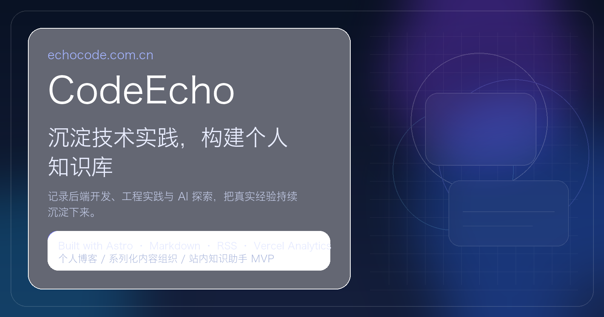

<div align="right">
  English | <a href="./README.md">中文</a>
</div>

<div align="center">
  
  <h1>CodeEcho · blog-astro</h1>
  <h3>📝 A personal tech blog built with Astro, focused on backend engineering, software practice, and AI explorations.</h3>
  <p><em>Starting as a blog, evolving toward a more structured personal knowledge site.</em></p>

  
  
  
  
  <a href="https://github.com/renhan123/blog-astro"></a>
  <a href="https://echocode.com.cn"></a>
</div>

---

## Overview

**CodeEcho / blog-astro** is a personal technical blog built with **Astro**.

This repository is not just a bare blog template. The goal is to turn it into a more structured personal knowledge site through:

- content writing
- content organization
- better discovery and reading navigation

Main themes right now:

- Backend engineering
- Software practice
- AI / Agent exploration

---

## Quick Start

### Online

- Site: https://echocode.com.cn
- Repo: https://github.com/renhan123/blog-astro

### Local Development

```bash
npm install
npm run dev
npm run build
npm run preview
```

Generate social share covers:

```bash
python3 scripts/generate_share_covers.py
```

---

## What this project includes

- A homepage with topic navigation
- Category filtering and instant search
- Tag cloud, archive, featured page, and series page
- Markdown-based article rendering
- Table of contents for posts
- Previous / next navigation
- Related reading and series navigation
- RSS / Sitemap / Open Graph / Twitter Card
- A lightweight on-site knowledge assistant at `/assistant/`

---

## Current content map

| Post | Category | Series | Date |
| --- | --- | --- | --- |
| [Build a personal blog with AI](./src/content/blog/ai-build-personal-blog.md) | backend | AI + Engineering Practice | 2026-09-03 |
| [From Loop to Graph Engineering](./src/content/blog/loop-to-graph-engineering.md) | backend | AI + Engineering Practice | 2026-09-03 |
| [Microservice evolution](./src/content/blog/microservice-evolution.md) | backend | Backend Practice | 2026-08-25 |
| [React performance optimization](./src/content/blog/react-performance.md) | frontend | - | 2026-08-20 |
| [Docker deployment guide](./src/content/blog/docker-deploy-guide.md) | devops | Backend Practice | 2026-08-15 |
| [MySQL indexing](./src/content/blog/mysql-indexing.md) | database | Backend Practice | 2026-08-10 |
| [Go concurrency](./src/content/blog/go-concurrency.md) | backend | Backend Practice | 2026-08-05 |
| [Redis practice](./src/content/blog/redis-practice.md) | database | Backend Practice | 2026-07-28 |

---

## Project Structure

```text
blog-astro/
├── public/
├── scripts/
├── src/
│   ├── components/
│   ├── content/
│   ├── layouts/
│   ├── pages/
│   ├── styles/
│   ├── content.config.ts
│   └── utils.ts
└── dist/
```

---

## Content Authoring

Posts live in:

```text
src/content/blog/*.md
```

The frontmatter schema is defined in `src/content.config.ts`.

Main supported fields:

- `title`
- `description`
- `pubDate`
- `category`
- `readTime`
- `tags`
- `draft`
- `series`
- `seriesTitle`
- `seriesOrder`
- `featured`
- `related`

---

## Deployment

This project outputs a static site, so it can be deployed to:

- Vercel
- Netlify
- GitHub Pages
- any static hosting platform

Current site config:

```js
site: 'https://echocode.com.cn'
```

---

## Roadmap

- [ ] Add more articles and series
- [ ] Improve the About page
- [ ] Upgrade homepage search
- [ ] Improve related reading and reading paths
- [ ] Evolve `/assistant/` into a stronger RAG / agent-like experience

---

## Contributing

Contributions and suggestions are welcome.

You can help by:

- reporting bugs
- suggesting improvements
- refining docs and copy
- improving content organization

---

## Contributors

<div align="center">
  <a href="https://github.com/renhan123/blog-astro/graphs/contributors">
    
  </a>
</div>

---

## Star History

<div align="center">
  <a href="https://star-history.com/#renhan123/blog-astro&Date">
    
  </a>
</div>

---

## License

This repository now uses a split license model suitable for a project that contains both code and original written content:

- **Code**: [MIT License](./LICENSE)
- **Articles and original content assets**: [CC BY-NC-SA 4.0](./LICENSE-CONTENT.md)

This keeps the implementation reusable while giving original written content a more appropriate protection boundary.

---

<div align="center">
  <p>⭐ If this project helps you, consider giving it a Star.</p>
</div>

